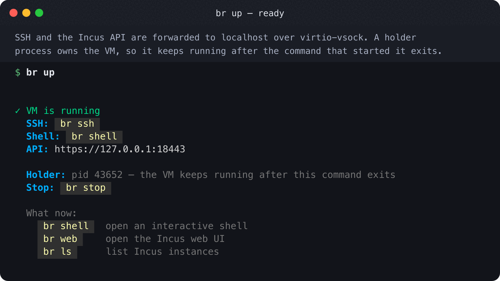
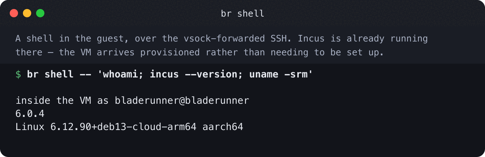
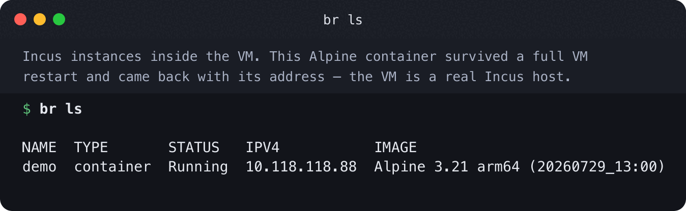

# bladerunner

`bladerunner` is a standalone Incus VM runner for macOS built directly on Apple Virtualization.framework via `github.com/Code-Hex/vz/v3`.

It is designed to provide the core behavior of a `colima --runtime incus` setup without Lima/Colima orchestration overhead:

- Architecture-aware defaults (`arm64` and `amd64`). Fresh installs boot the pre-baked bladerunner guest image (Debian 13 trixie + Incus, no first-boot apt); the Debian genericcloud image is the warned auto-fallback and the `--debian-image` escape hatch. Ubuntu and other cloud images remain reachable via `--image-url` or `BLADERUNNER_BASE_IMAGE_URL`.
- Incus daemon shipped in the pre-baked image (or bootstrapped via cloud-init on the Debian fallback path).
- Localhost-accessible SSH and Incus HTTPS endpoints via virtio-vsock port forwarding.
- Incus web dashboard availability through the forwarded API endpoint.
- Optional bridged networking (for transparent L2 presence) when signed with `com.apple.vm.networking`.
- Startup report generation with VM, network, and access details.
- Optional GUI console window (`StartGraphicApplication`) with serial output logged to file.
- Rotating structured logs with stage-level observability and live progress indicators for long-running tasks.
- No OpenID setup by default.

## What it looks like

`br up` starts the VM and shows how to reach it. The boot is staged, and the
guest console is shown live.



`br shell` opens a shell in the guest. Incus is already in operation there.



`br ls` lists the Incus instances in the VM.



More screenshots are in [contrib/assets](contrib/assets), with the tooling that
makes them.

## Requirements

- **Apple Silicon Mac** (M1/M2/M3/M4) - Intel Macs not supported
- macOS 13+ (Ventura or later)
- Xcode Command Line Tools (includes codesign utility)

  ```bash
  xcode-select --install
  ```

- Binary must be code-signed with Virtualization entitlement (automatic with Homebrew)
- For bridged networking, additional VM networking entitlement required

## Installation

### Homebrew (Recommended)

```bash
brew install stuffbucket/tap/bladerunner
```

The binary is automatically signed with required entitlements during installation.

Homebrew installs update via `brew upgrade bladerunner`.

### Download (`.dmg`)

Every release also ships a signed, notarized `.dmg` installer on the
[Releases page](https://github.com/stuffbucket/bladerunner/releases), named
`bladerunner_<version>_darwin_aarch64.dmg` (with a matching `.sha256`).

1. Download the `.dmg` from the latest release.
2. (Optional) verify it:

   ```bash
   shasum -a 256 -c bladerunner_<version>_darwin_aarch64.dmg.sha256
   ```

3. Open the `.dmg` and drag **Bladerunner.app** to `/Applications`.

The bundle is code-signed with the Virtualization entitlement and notarized, so
Gatekeeper allows it on first launch — no `xattr` dance required.

DMG installs self-update in place:

```bash
br self-update          # download + verify + install the latest signed .app
br self-update --check   # just report whether a newer version is available
```

`br self-update` verifies the new bundle's Ed25519 signature before replacing
anything and refuses to run on Homebrew-managed installs (use `brew upgrade`
for those). It is distinct from `br upgrade`, which hands the *running* control
server to a new binary already on disk.

### Build from Source

Requires Xcode Command Line Tools:

```bash
xcode-select --install
```

Build and sign:

```bash
make build
make sign
```

Or manually:

```bash
go build -o bin/br ./cmd/bladerunner
codesign --entitlements vz.entitlements -s - bin/br
```

## Run

Default (shared network + localhost forwarding):

```bash
br start
```

With GUI console window:

```bash
br start --gui
```

Bridged network on `en0`. This is a persisted setting, not a start flag: write
it into `~/.local/state/bladerunner/settings.json` (the document the menubar's
Settings screen writes), then start. Absent fields keep their defaults:

```json
{ "networkMode": "bridged", "bridgeInterface": "en0" }
```

```bash
br start
```

Custom image path (raw disk image):

```bash
br start --image-path /path/to/base.raw
```

The log file is `<state-dir>/bladerunner.log`. To put it somewhere else, move
the whole state directory:

```bash
br start --state-dir /tmp/bladerunner-scratch   # logs to /tmp/bladerunner-scratch/bladerunner.log
```

Optional log level. Accepts `debug`, `info`, `warn` (alias `warning`), or
`error` (case-insensitive). Unknown or unset values default to `info`:

```bash
BLADERUNNER_LOG_LEVEL=debug br start
```

## Access

After startup, the tool prints a report and writes JSON report data to:

- `~/.local/state/bladerunner/startup-report.json`

Key defaults:

- Incus API/UI endpoint: `https://127.0.0.1:18443`
- SSH endpoint: `127.0.0.1:6022`
- Dashboard URL: `https://127.0.0.1:18443/ui/`
- Log file: `~/.local/state/bladerunner/bladerunner.log` (rotated with compression)

Example SSH:

```bash
ssh -p 6022 incus@127.0.0.1
```

Example REST call:

```bash
curl --cert ~/.local/state/bladerunner/client.crt --key ~/.local/state/bladerunner/client.key -k https://127.0.0.1:18443/1.0
```

## Disks

A *disk* is a `.disk` JSON manifest that bundles an image identity, VM sizing
recommendations, and a boot mode (headless or GUI) — think of it as a labeled
floppy you slide in and power on. Booting a disk materializes its image, applies
sizing, and runs the VM in an isolated per-disk state slot, restoring saved guest
RAM when present. A disk that pins its image SHA-256 (e.g. after `br disk
bake`) is materialized once into a shared content-addressed cache and reused
across slots; the digest is verified before use.

```bash
br disks                 # list the shelf (builtins + your disks) and attached cartridges
br boot <name|url|path>  # power on a disk (restores saved RAM if present)
br eject                 # cleanly power off the running VM (ACPI shutdown)
br disk new <name>       # scaffold a new user disk manifest
br disk bake <name>      # build its qcow2 and record the image SHA-256
br disk pack <name>      # pack a disk into an AirDrop-able cartridge
```

`br eject` performs a clean ACPI shutdown (it loops the power button and
waits for the guest to power off, then forces the stop after `--timeout`). For a
same-host RAM resume use `br save` + `br restore` instead — eject is a
clean cold-stop by design.

Two disks ship built in:

- **`incus`** — headless Incus host using the pre-baked bladerunner guest image
  (the `guest-image-latest` release; this is the classic `br start` setup).
- **`debian-trixie-gui`** — a Debian Trixie desktop that opens in a VZ window.

`br boot <name>` resolves a catalog disk; `br boot <url>` boots a one-off
headless image by URL; `br boot ./my.disk` boots a manifest file directly.
`--cpus`/`--memory`/`--disk` override the manifest's sizing, and
`--gui`/`--headless` override its boot mode. `--no-restore` forces a cold boot.

Layout:

- User disks: `~/.config/bladerunner/disks/*.disk`
- Per-disk state slots: `~/.local/state/bladerunner/disks/<name>/` (each slot has
  its own `disk.raw`, `saved-state.bin`, console log, EFI vars, and cloud-init)
- Shared image cache (SHA-256-pinned disks only): `~/.local/state/bladerunner/cache/images/<sha256>.raw`

`br disk bake` shells out to `scripts/build-guest-image.sh` and is a
host-side developer action: it requires `bash`, `qemu-img`, and the script's
build dependencies (`libguestfs-tools`, likely `sudo`). Builtin disks are
read-only — fork one with `br disk new <name> --from <builtin>` first.

## Cartridges

A *cartridge* is a single, self-contained, AirDrop-able macOS disk image holding
a complete bootable VM: the disk manifest, the root disk, EFI + cloud-init state,
and a read-**write** host↔guest share folder. Because `br eject` always
powers the guest off cleanly via ACPI, a cartridge is **always** in a consistent
cold-boot state — so you can AirDrop the file to any Mac running bladerunner and
`br boot <file>` just works (a clean cold boot). The clean-shutdown invariant
is what makes AirDrop safe: no dirty filesystem, no host-bound RAM snapshot.

The honest tradeoff: the **disk** is portable (cold-boot on any Mac), while
same-host **RAM resume** is intentionally out of scope — we shut down cleanly
instead of carrying a machine-bound memory image around.

```bash
br disk pack incus                 # build ./incus.sparseimage (runnable)
br disk pack incus --ship          # also build ./incus.dmg (compressed AirDrop artifact)
br boot ./incus.sparseimage        # mount + cold-boot the cartridge
br boot ./incus.dmg                # materialize a working copy, then boot it
br eject                           # clean ACPI shutdown, then detach the cartridge
br disks                           # also lists attached cartridges (booted/ejected)
```

`br disk pack <name>` resolves a catalog/user disk, creates an APFS sparse
image sized to the disk plus headroom (override with `--size`), attaches it, writes
`disk.json`, materializes the bootable `root.img` (via the same image cache /
`qemu-img` path boot uses), and creates `state/` and `share/`. `--out` overrides
the output path; `--ship` additionally produces a compressed read-only `.dmg`
(the AirDrop artifact). `--arch` selects the root image's architecture.

`br boot <cartridge>` attaches the image browsably — macOS places the volume at
`/Volumes/bladerunner-<name>`, where you can see and eject it — roots the VM
inside it (`root.img`, state under `state/`, the RW share at `share/`), and
**owns** the mount, detaching it on exit. A `.dmg` is first converted to a
working `.sparseimage` so the shipped read-only artifact stays pristine.
(`br disk pack` still attaches privately under the state dir, so packing and
booting never contend for the same mountpoint.)

The **RW share** is exposed to the guest over VirtioFS (tag `bladerunner-share`)
and mounted at `/mnt/share` by a generated systemd `.mount` unit (with an fstab
fallback). VirtioFS maps host files to the guest's mounting context (root), so
the bootstrap `chown`s `/mnt/share` to the SSH user — drop files in `share/` on
the host and read/write them at `/mnt/share` in the guest, and vice versa.

Cartridge layout (at the mountpoint):

```
disk.json            the Manifest (image source is THIS cartridge: root.img)
root.img             the bootable raw disk (sparse on APFS)
state/efi-vars.bin   EFI variable store
state/cloud-init/    cloud-init seed
share/               RW host↔guest VirtioFS folder
```

Cartridges require macOS (they are backed by `hdiutil` + APFS sparse images);
packing also needs `qemu-img`.

## Instances

Every running VM is owned by exactly one process: `br start`, or the minimal
holder `br vmd` — an internal command, spawned detached (by `br watch` or the
menubar, when a cartridge is inserted) so the VM survives the CLI and the
menubar exiting. Either way that process binds the instance's control socket and
publishes a registry entry under
`~/.local/state/bladerunner/instances/<name>.json`, so any later `br` can find
it — including a cartridge mounted somewhere the old directory scan never
looked.

```bash
br instances                  # list running VMs with their ports and holder PIDs
br status --instance <name>   # --instance selects the VM (env BLADERUNNER_INSTANCE)
br stop --instance <name>     # orderly drain of one specific VM
br watch                      # notice inserted cartridges and offer to boot them
```

`--instance` is a root flag, so it appears in every verb's help — but only
`status`, `stop`, `reset`, `config`, `shell`, `ssh`, `ls` and `eject` currently
resolve it. Other verbs act on the default instance without saying so; see
[docs/cartridge-runtime/behaviour-changes.md](docs/cartridge-runtime/behaviour-changes.md).

With a single VM running there is nothing to choose and `--instance` can be
omitted, so the single-VM workflow is unchanged. The default instance keeps the
well-known ports (`6022` / `18443` / `18444` / `15556` / `15557`); every
*additional* instance takes ephemeral ports instead of failing to bind, which is
what lets several cartridges run side by side. `br instances` reports what each
one actually got.

A booted cartridge is mounted **browsably**, under `/Volumes`, precisely so it
can be ejected by hand — because ejecting it is the gesture that spins the VM
down. `br watch` (and the menubar) do the other half: a cartridge you AirDrop in
and double-click is noticed, checked, and offered as a boot.

Shutdown is a real drain on every path: the guest is asked to power itself off
(ACPI), the host waits for it to genuinely reach the stopped state, and only
when `--timeout` expires does it escalate to a forced stop — and say so. On a
cartridge the holder additionally registers a DiskArbitration unmount-approval
callback for its own volume, so asking macOS to eject the cartridge is answered
with *"bladerunner is shutting down the VM on this cartridge"* and starts that
same drain in the background; the volume unmounts once the guest is stopped.

See [docs/cartridge-runtime/usage.md](docs/cartridge-runtime/usage.md) for the
full workflow — pack, ship, boot several at once, eject safely — and for the
limitations that come with it. If you already script `br`, read
[docs/cartridge-runtime/behaviour-changes.md](docs/cartridge-runtime/behaviour-changes.md):
`br stop --force` now cuts power immediately, `br stop -t` defaults to 60s,
`br reset` refuses against a running VM, and ports are a preference rather than a
fixed allocation.

## Notes

- The default base image is the **pre-baked bladerunner guest image**: Debian 13 trixie with Incus. `scripts/build-guest-image.sh` builds it. The `build-guest-image` workflow publishes it under the `guest-image-latest` release. Fresh installs boot it directly, so first boot is faster and runs no apt. bladerunner fetches it fail-closed against its published `.sha256` sidecar. A missing, unreachable, or mismatched sidecar is fatal for the hosted image, because bladerunner never boots an unverified image.
- **Warned auto-fallback:** bladerunner falls back when it cannot use the pre-baked image. The causes are a missing or renamed release asset for the architecture, a download error, or a bad, missing, or unreachable checksum sidecar. It emits a `WARN` and uses the pinned Debian 13 (trixie) genericcloud qcow2 with the first-boot cloud-init path. That fallback is itself SHA-512 fail-closed against an embedded pin. The invariant holds: you always boot a **verified** image, either verified-hosted or verified-Debian. bladerunner logs the path it chose.
- **Escape hatch:** pass `--debian-image`, or set `BLADERUNNER_FORCE_DEBIAN_IMAGE=1`, to force the Debian genericcloud and cloud-init path. This is the "bring your own generic image" opt-out. `--hosted-image`, or `BLADERUNNER_FORCE_HOSTED_IMAGE=1`, forces the pre-baked image, which is already the default. The two flags are mutually exclusive. You cannot combine either one with `--image-url` or `--image-path`. To use Ubuntu 24.04 or another distribution, set `--image-url` or `BLADERUNNER_BASE_IMAGE_URL`.
- The base image can be raw or qcow2 format. qcow2 images are automatically converted to raw via `qemu-img`.
- First boot on the Debian fallback path can take several minutes. cloud-init installs and configures Incus during that time. The pre-baked default skips this work.
- Downloaded base images are checksum-verified. The pre-baked default and any disk-manifest-pinned image are SHA-256 verified fail-closed. A user-supplied `--image-url` uses a tolerant sidecar check instead: a missing sidecar is a warning, not an error, because arbitrary upstream hosts rarely publish one.
- `br status` surfaces the pre-baked image build date from `/etc/bladerunner-image-version` when present.
- GUI output is handled by VZ graphics window; serial console is logged at `console.log`.
- Extended operations (download, VM readiness, Incus readiness) show live progress indicators in terminal.
